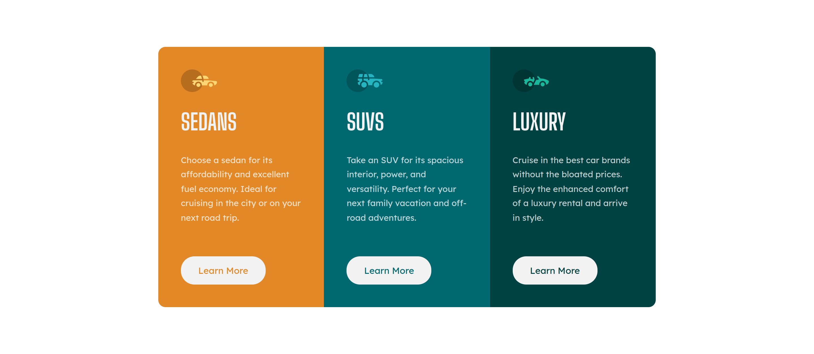
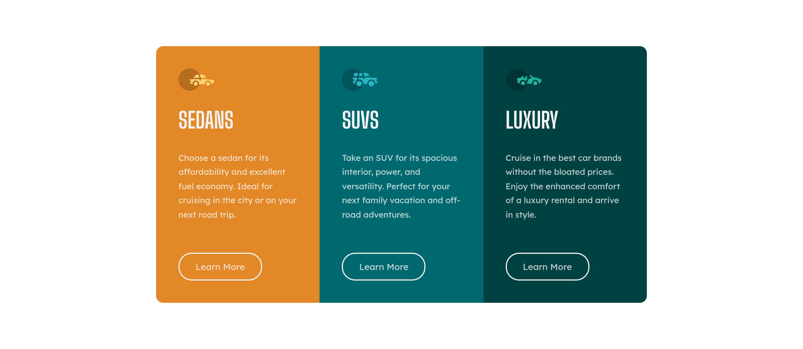

# Frontend Mentor - 3-column preview card component solution

This is a solution to the [3-column preview card component solution on Frontend Mentor](https://www.frontendmentor.io/challenges/3column-preview-card-component-pH92eAR2-). Frontend Mentor challenges help you improve your coding skills by building realistic projects.

## Table of contents

- [Overview](#overview)
  - [Screenshot](#screenshot)
  - [Links](#links)
- [My process](#my-process)
  - [Built with](#built-with)
  - [What I learned](#what-i-learned)

## Overview

### Mobile

### Desktop

### Desktop - Active States

### Links

- Live Site URL: [Live on GitHub.io](https://alchrdev.github.io/3-column-preview-card-component/)

## My process

### Built with

- Semantic HTML5 markup
- CSS custom properties
- Flexbox
- CSS Grid
- Mobile-first workflow

## Author

- Frontend Mentor - [@alchrdev](https://www.frontendmentor.io/profile/alchrdev)
- Twitter - [@alchrdev](https://www.twitter.com/alchrdev)
